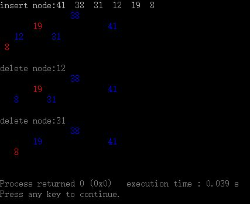
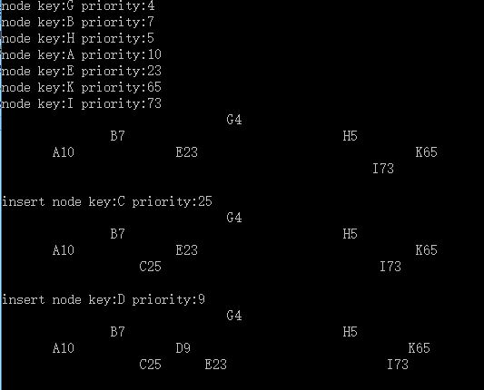

# AlgorithmExperiment
算法实验      
快速排序、背包问题(01背包、分数背包)、任务调度、平衡树（红黑树red black tree、treap tree）     
红黑树效果图     
       
TreapTree效果图     
       
       
图算法中实现了图的深度、广度优先遍历，以及Dijkstra最短路径问题。
echo "# AlgorithmExperiment" >> README.md   
git init    
git add README.md     
git commit -m "first commit"     
git remote add origin https://github.com/xuezhaojiang/AlgorithmExperiment.git      
git push -u origin master      
…or push an existing repository from the command line     
      
git remote add origin https://github.com/xuezhaojiang/AlgorithmExperiment.git      
git push -u origin master      
